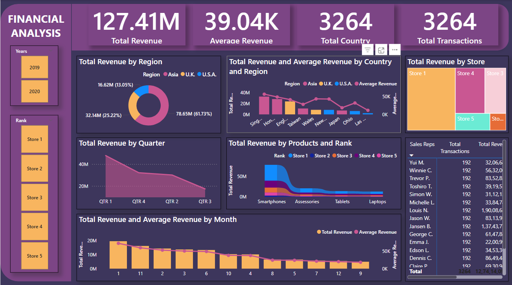

# Financial-Analysis
# 💰 Financial Analysis Dashboard

## 📝 Description

This project is a comprehensive **Financial Analysis Dashboard** developed in **Power BI**, showcasing total revenue, average revenue, transactions, and regional performance across multiple stores, products, and time periods. The interactive dashboard empowers business teams to understand revenue trends, product performance, and regional sales distribution at a glance.

---

## 🎯 Purpose

- To visualize total and average revenue across regions, countries, and time periods
- To compare store-level and product-level performance using interactive visuals
- To assist business teams in identifying revenue peaks and opportunities
- To create a responsive and dynamic report for real-time financial insights

---

## 🛠️ Tools & Technologies Used

| Tool            | Purpose                                    |
|-----------------|--------------------------------------------|
| **Power BI**    | Interactive dashboard design               |
| **Power Query** | Data cleaning and transformation           |
| **DAX**         | Measures and KPIs for average revenue, total revenue, etc. |
| **Excel/CSV**   | Source dataset used for financial metrics  |

---

## 📊 Key Visuals

| 📈 Visual | 💬 Description |
|----------|----------------|
| **KPIs** | Shows Total Revenue, Average Revenue, Total Transactions, and Country Count |
| **Pie Chart** | Total Revenue by Region (Asia, USA, UK) with percentages |
| **Column + Line Chart** | Revenue and Average Revenue by Country |
| **Treemap** | Total Revenue by Store |
| **Area Chart** | Revenue by Quarter |
| **Stacked Bar** | Revenue by Products (Smartphones, Tablets, Laptops) and Store Rank |
| **Line & Column** | Monthly breakdown of Revenue & Average Revenue |
| **Table** | Transaction-level detail by Sales Reps |

📷 *Sample Dashboard Preview*:

---

## 📈 Analysis & Insights

1. **Top Performing Region**:  
   - Asia dominates revenue with **61.73% share**, followed by the U.K. and U.S.A.

2. **High Revenue Quarters**:  
   - **QTR 1** is the strongest quarter with revenue over **40M+**.

3. **Best-Selling Product**:  
   - **Smartphones** are the leading category across all stores.

4. **Top Store & Sales Reps**:  
   - Store 1 consistently ranks highest in revenue.
   - Sales reps like **Jansen B.** and **Jason W.** lead in transaction volume and revenue.

---

## ✅ Conclusion

The **Financial Analysis Dashboard** provides stakeholders with a clear, interactive view of revenue patterns and sales performance. It helps uncover business opportunities by breaking down KPIs across time, region, and store ranks — enabling faster, smarter decisions.

---

